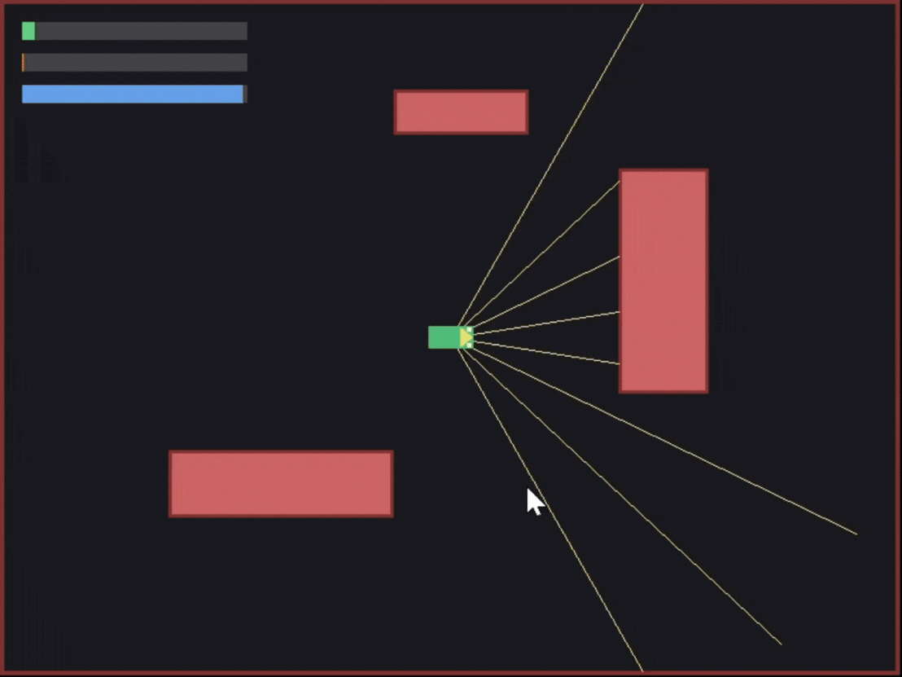

# ecopilot

An energy-aware 2D autonomous driving simulator, written in C with SDL2.



The vehicle navigates a small map using a simulated lidar sensor (raycasting),
steering itself around obstacles while a real-time energy model tracks how
efficiently it drives.

## Features

- **Vehicle physics** – acceleration, friction, and rotation driven by
  delta-time, so movement speed is independent of frame rate.
- **Simulated lidar** – 8 rays cast across a 120° field of view using
  ray-vs-rectangle intersection (the "slab method").
- **Autonomous obstacle avoidance** – steers away from the side with less
  clearance, and caps its speed near obstacles instead of just turning.
- **Collision handling** – boundary walls keep the vehicle on-screen; a
  circle-vs-rectangle check prevents it from clipping into obstacles.
- **Energy model** – consumption scales with speed² (aerodynamic drag) plus
  a penalty for hard acceleration/braking. An exponential moving average
  turns this into a live eco-score (0–100) that reflects recent driving,
  not a lifetime average.
- **HUD** – on-screen bars for speed, consumption rate, and eco-score.

## Controls

| Key | Action |
|---|---|
| ↑ | Accelerate |
| ↓ | Reverse / brake |
| ← / → | Turn manually (the vehicle also steers itself near obstacles) |

## Architecture

```
src/
├── main.c      # window/render loop, input, HUD, ties modules together
├── vehicle.c   # position/heading/speed state and movement update
├── sensor.c    # raycasting (lidar) and avoidance-direction logic
└── energy.c    # consumption model and eco-score calculation
include/        # corresponding headers
```

Each module owns one responsibility — `main.c` doesn't compute avoidance
logic or energy math directly, it just calls into `sensor` and `energy` and
acts on the results.

## Building (Windows, via vcpkg)

Requires a C compiler (MSVC via Visual Studio Build Tools) and CMake.

```powershell
# One-time: install SDL2 via vcpkg
git clone https://github.com/microsoft/vcpkg.git
cd vcpkg
.\bootstrap-vcpkg.bat
.\vcpkg install sdl2:x64-windows

# Build the project
cd ecopilot
mkdir build
cd build
cmake .. -DCMAKE_TOOLCHAIN_FILE=<path-to-vcpkg>/scripts/buildsystems/vcpkg.cmake
cmake --build .
.\Debug\ecopilot.exe
```

## Technical notes

A few design decisions worth mentioning:

- **Raycasting** uses the slab method for ray-vs-AABB intersection, checked
  against every obstacle per ray. With 8 rays and a handful of obstacles this
  is cheap enough to run every frame at 60 FPS.
- **The eco-score originally used a lifetime average** (`total_energy /
  elapsed_time`), which meant a few seconds of fast driving early on could
  permanently tank the score — recovering it would have required an equally
  long period of gentle driving. It was switched to an exponential moving
  average so the score reflects *recent* driving instead.
- **Collision response is intentionally simple**: the vehicle is treated as
  a circumscribed circle rather than an oriented rectangle. This is enough to
  prevent clipping into obstacles but isn't precise for tight corners — a more
  accurate (and more complex) solution would use full rectangle-vs-rectangle
  resolution.

## Possible next steps

- Replace the rule-based avoidance with a proper path-planning algorithm
  (e.g. potential fields or A*) that could navigate tighter gaps.
- Load a real sprite for the vehicle instead of drawing primitives.
- Log driving sessions and compare eco-scores across runs.